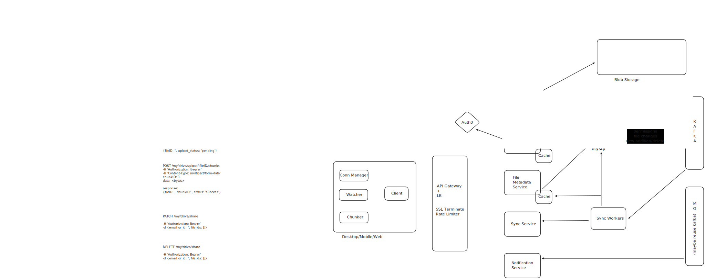
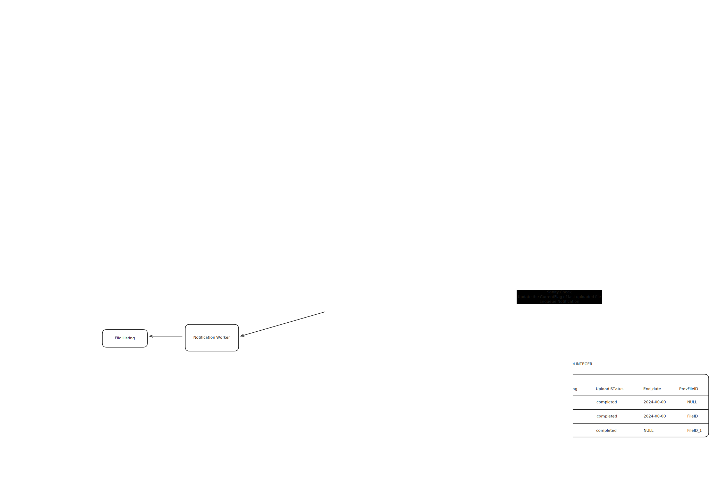

# arbokcore

Backend core for file storage system.

This service handles chunked file uploads and downloads. So when you re-upload the same file:

- if possible, it updates only updated chunks
- otherwise, upload the file in short chunks of 4MB, transferred in groups of 3

## Requirements

- go v1.22.0
- redis
- sqlite3

## Starting

- Make sure `redis` is running
- `make run.setup`
- `make run.server` to run the server
- `make run.supervise.worker` to run the worker

## Overview:

Working:

[Verisoning with Slowly changing dimension](https://en.wikipedia.org/wiki/Slowly_changing_dimension)

[WorkQueues for controlled concurrency](https://nesv.github.io/golang/2014/02/25/worker-queues-in-go.html)

[SQL ISOLATION Levels](https://learn.microsoft.com/en-us/sql/t-sql/statements/set-transaction-isolation-level-transact-sql?view=sql-server-ver16&redirectedfrom=MSDN)

[Postgres Isolation Levels](https://www.postgresql.org/docs/current/transaction-iso.html)

[Sqlite Isolation](https://www.sqlite.org/isolation.html)
